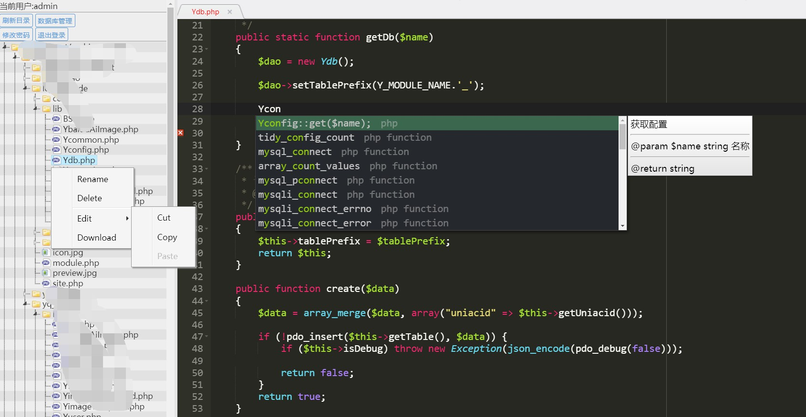

# php_online_coding
该项目是以PHP为基础，实现在浏览器中对服务器代码进行在线编辑和查看。
DEMO地址 : [http://demo.yynan.cn](http://demo.yynan.cn "http://demo.yynan.cn")

# 编辑器快捷键
快捷键帮助: Ctrl+Alt+H
搜索批量替换: Ctrl+F => alt+Enter 即可选中全部需要替换的内容
批量替换: Ctrl+H
找到下一个相同的单词: Alt+K  Alt+Shift+K
光标选多列: Alt+左键(上下拉)
关闭当前标签: Esc
设置菜单: Ctrl-q
在当前行下另起一行: Shift+Enter

# 代码自动补全
文件位置: Config/autoCompleter.php

# 功能
- 基于Jstree的文件及文件夹查看、添加、删除、移动、复制操作
- 文件内容在线查看和编辑
- 文件及文件夹上传
- 用户访问IP、访问文件和尝试输入密码次数限制
- 用户修改密码
- 用户操作日志记录
- 用户登录及修改密码邮件通知
- 引入数据库管理工具(adminer)

# 界面


# 目录

	php_online_coding/
		├── App       // 应用文件
			├── Controller // 业务处理
			├── Core       // 核心文件
			├── Lib        // 引用库文件
			└── View       // 视图文件
		├── Cache     // 缓存文件
		├── Config    // 配置文件
		├── Log       // 用户操作日志
		├── plugins   // 第三方插件库
		├── public    // 静态资源文件
		├── index.php // 入口文件

# 使用
- 1，将该项目放到服务器，使其可以被客户端访问的路径中（例如：【你的域名】/php_online_coding）。
- 2，进入Config/app.php，设置该编辑器可以在线访问的服务器文件夹路径 和 登录密码。（如果是linux系统，需要将该项目 和 需要修改的路径设置权限为777）
```php
	// 用户默认密码, 配置用户后默认使用本密码登录, 之后可以自行修改密码
	'default_password' => 'admin',

	// 用户表 , 配置用户与其相对应的可访问文件
	'users' => [
		[
			'name' => 'admin',
			'access_dirs' => ['D:/WWW/test'], // 该用户可以访问的文件夹
			'super_user' => true, // 是否可以修改本项目 ,请慎重指定(默认有访问数据库权限)
		],
	...
	// 以上为基本功能配置项, 更多功能可以在 Config/app.php 查看对应配置项
```
- 3，在浏览器中访问该项目！。

# 注意
1. 该项目只是用于学习、开发及测试阶段。安全性，效率等问题还有待提高。
2. 使用功能详细的配置项功能可以在 Config/app.php 中查看配置

# 感谢
感谢 [jQuery](https://github.com/jquery/jquery) 、[ace](https://github.com/ajaxorg/ace) 、 [jstree](https://github.com/vakata/jstree) 、 [layer](https://github.com/sentsin/layer) 、[H-ui 前端框架](http://www.h-ui.net/) 、[adminer](https://github.com/vrana/adminer)
